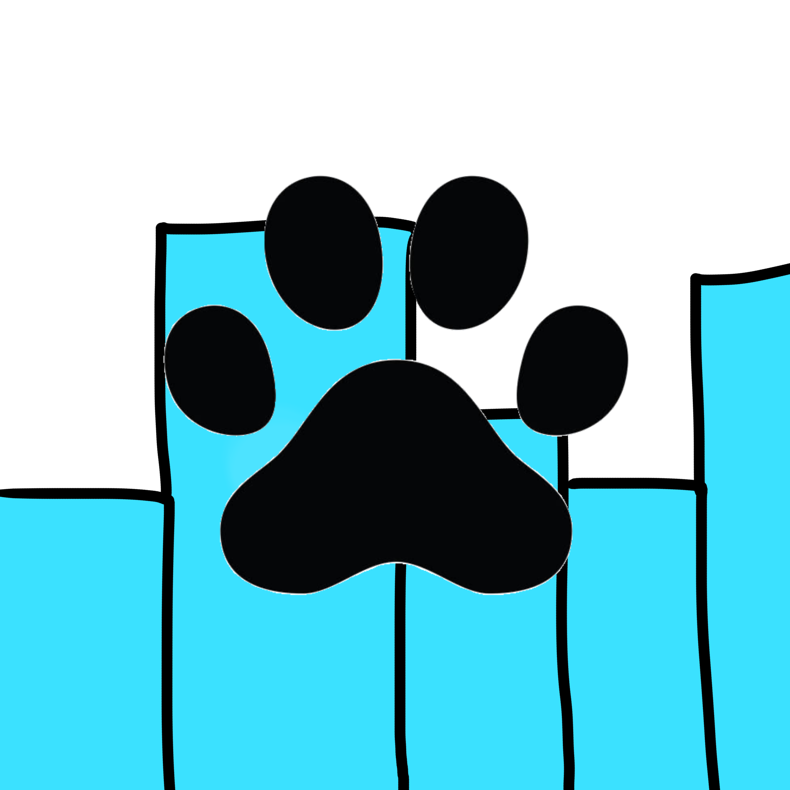

# NekoBeats 
> v2.3.3

<p align="center">
  
</p>

A sleek audio visualizer that turns your music into floating light bars. Revived and better than ever.


## Features 🌟

- **Real-time audio visualization** using system output
- **Fullscreen floating bars** that don't interrupt your work
- **Click-through mode** (bars won't block clicks)
- **Customizable themes** with color picker
- **Adjustable bars**: count, height, opacity
- **Draggable window** when needed
- **Revamped UI** - Cleaner, more intuitive control panel
- **Custom bar presets** (shapes, animations, colors)
- **Built-in installer** - One-click setup
- **Recording visualizations** - Optimized for streaming and OBS

## Controls 🎮

| Control | Function |
|---------|----------|
| **Bar Color** | Change bar color (any color you want!) |
| **Opacity** | Make bars more/less transparent |
| **Height** | Adjust how tall bars grow |
| **Bar Count** | 32-512 bars across your screen |
| **Click Through** | Toggle if bars block mouse clicks |
| **Draggable** | Move the visualizer around |
| **Recording Mode** | Optimize for streaming and recording |
| **Exit** | Close the application |

## Recording 🎥

Want to record your NekoBeats visualizations? We recommend using **[OBS Studio](https://obsproject.com/)** - it's free and gives you full control:

1. Download and open OBS
2. Enable **Streaming Mode** in NekoBeats Control Panel in Tab "Window"
3. Click **"+ Scene"** to create a new scene
4. Add NekoBeats window as a source (Window Capture or Game Capture)
5. Add a chroma key effect and set it to magenta. (The magenta BG marks if the visualizer shows up.)
6. Configure audio (System Audio or Mic)
7. Click **Start Recording** and enjoy!

OBS handles video compression, audio-video sync, and quality settings - way better than anything we could build in-app.

## Bar Presets 🎨

Customize bar shapes, animations, and colors with `.nbbar` preset files!

**Features:**
- **Bar Shapes**: Rectangle, Circle, Triangle, Rounded, Gradient
- **Animations**: Sine, Cosine, Square, Sawtooth, None
- **Custom Colors**: Define color arrays that cycle through bars
- **Beat Sync**: Bars pulse with the beat
- **Glow Effects**: Add glow intensity to bars

**Example preset (save as `yourbarthemename.nbbar`):**
```
{
  "name": "My Cool Bar Theme",
  "barShape": "Circle",
  "barWidth": 30,
  "barHeight": 400,
  "colors": ["#FF0080", "#00FFFF", "#FFFF00"],
  "animationType": "Sine",
  "animationSpeed": 0.8,
  "beatSync": true,
  "glow": 2.5
}
```

Load presets in NekoBeats via Load Bar button in the control panel. Share your creations on the Community Themes page!
## Installation ⚡

1.	Download `NekoBeats-2.3-Installer.exe` from Releases
2.	Run the installer and follow the setup wizard
3.	Play some music 🎶
4.	Adjust settings in the control panel

# Build from Source 🛠️
```
git clone https://github.com/justdev-chris/NekoBeats-V2.git
cd NekoBeats-V2
dotnet restore
dotnet publish -c Release -r win-x64 --self-contained true
```

## Requirements 📋
- Windows 10/11
- .NET 8.0 Runtime (included in self-contained build)
- Audio output playing music

## How it Works 🔬

NekoBeats captures your system audio output using NAudio, performs FFT analysis to extract frequencies, and visualizes them as colorful bars that pulse to the beat. The bars are rendered in a transparent overlay window that sits above everything else.

# V2.3 Updates 🚀
- ✅ Revamped UI - Cleaner, more intuitive interface
- ✅ Built-in Installer - One-click setup and installation
- ✅ Recording Visualizations - Optimized streaming mode for OBS
- ✅ Improved Stability - Better audio handling and memory management
- ✅ Performance Optimizations - Smoother rendering and faster response times
# **Previous V2 Improvements 🎯**
- ✅ Proper FFT processing (smoother visualization)
- ✅ Real color picker (not just preset themes)
- ✅ Click-through technology (use PC while visualizing)
- ✅ More bars (up to 512 for detailed spectrum)
- ✅ Better performance (60 FPS rendering)
- ✅ Modern UI (separate control panel)
- ✅ Single EXE (no dependencies needed)
- ✅ Draggable window (move visualizer around)
- ✅ Custom bar presets (shapes, animations, colors)

# Troubleshooting 🔧
No bars showing?
- Make sure audio is playing through your default output
- Check that your audio isn’t muted
- Try adjusting bar count in settings
Visualizer laggy?
- Reduce bar count in settings
- Close other intensive applications
- Check system audio device
Can’t click through?
- Enable “Click Through” in control panel
- Make sure no other apps are forcing focus
- Restart the application
Recording issues?
- Enable “Recording Mode” in control panel
- Check OBS audio settings
- Make sure NekoBeats audio is routed correctly

# Known Issues ⚠️
1. If you change your sound output, NekoBeats may not detect the audio anymore and may have to restart NekoBeats.
2. Some **CUSTOM** themes may lower peformance or interfere with your desktop.
3. The more bars, more effects, more settings you add obviously will lower peformance, maybe lower the FPS.
4. The update checker will **NOT** work without a working internet connection.
   
# License 📄
MIT License - do whatever you want with it!

# Credits 👏
	
  -	NAudio for audio capture
	-	FFT algorithm for frequency analysis
	-	Original NekoBeats V1 for inspiration
	-	You for using it! 🎧

Made with ❤️ for music lovers everywhere. Turn up the volume and watch the magic happen!
